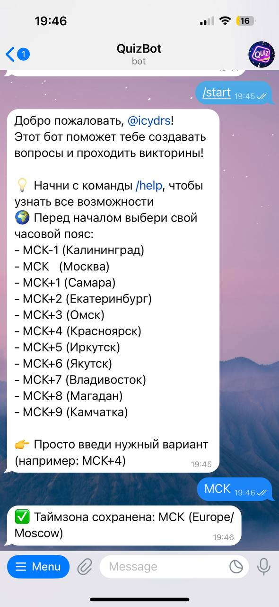
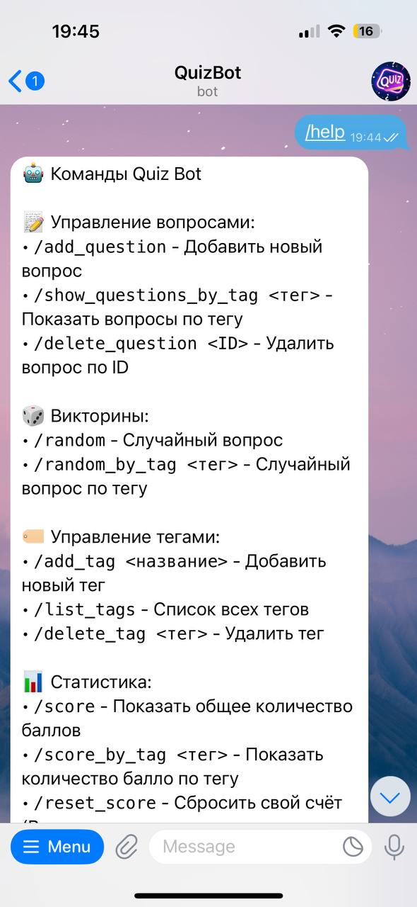
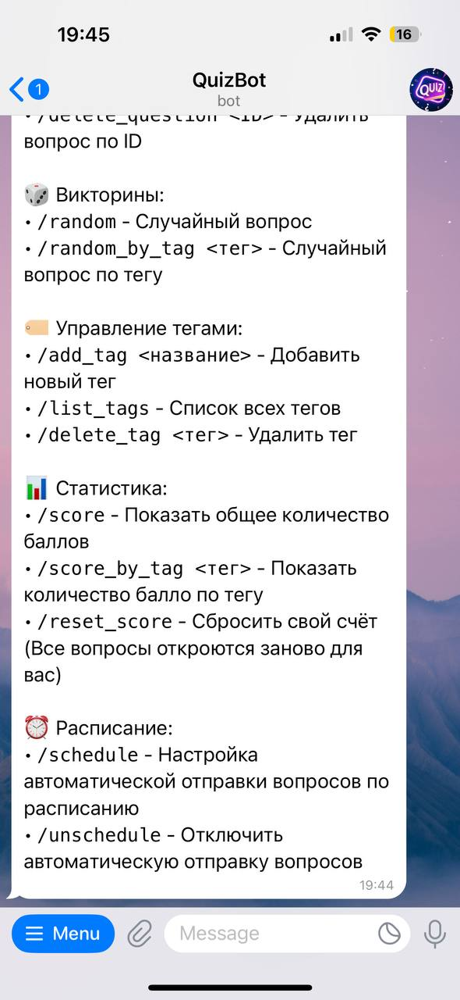
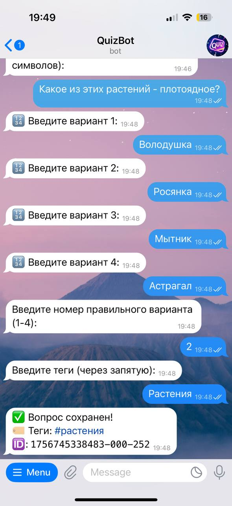
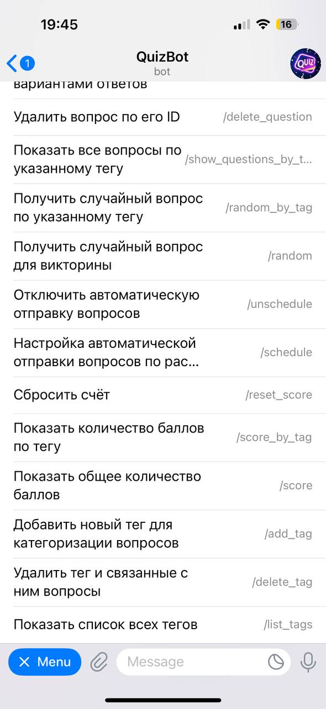
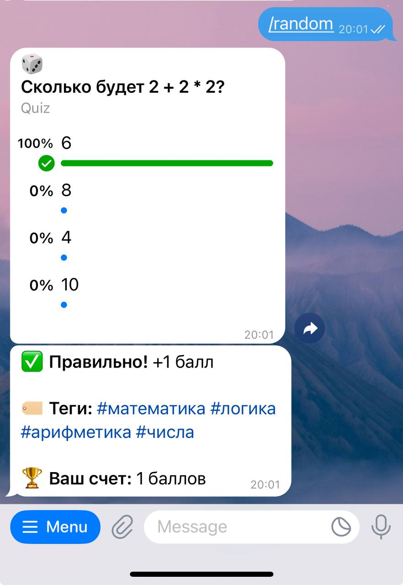
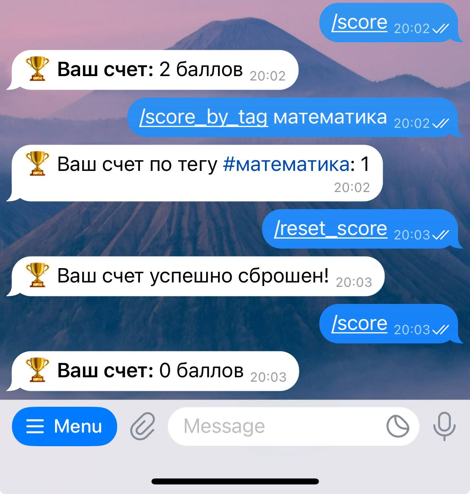
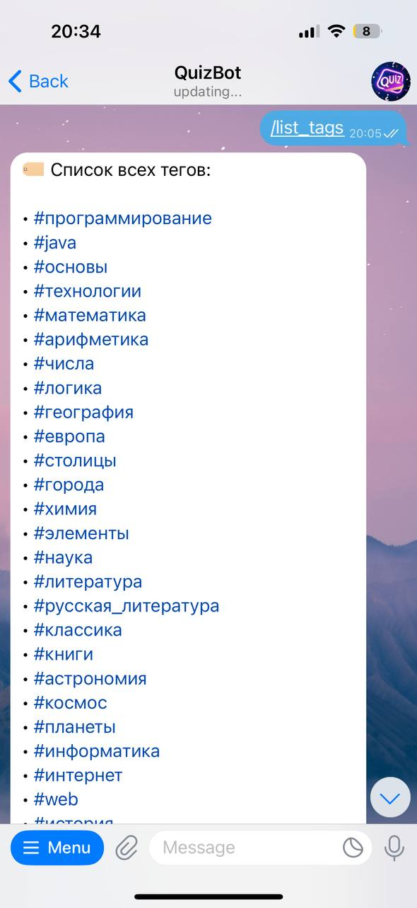

# QuizBot — Telegram-бот для управления викторинами

Telegram-бот для создания, управления и участия в викторинах, реализованный на основе Java Spring с использованием модульной архитектуры и планировщика задач.

## Ссылки

**Docker Hub репозиторий с Docker-образом:**
[Docker Image](https://hub.docker.com/r/quizbot/quizbot)

**Telegram-бот:**
[@tlgrm_quiz_bot](https://t.me/tlgrm_quiz_bot)

## Технологический стек

- **Язык программирования:** Java 23
- **Spring Framework 6.2.10** (без Spring Boot)
- **Spring Data JPA 3.5.3** - слой доступа к данным
- **Hibernate 6.6.1** - объектно-реляционное отображение
- **PostgreSQL** - реляционная СУБД
- **Telegram Bots API 6.9.7.1** - взаимодействие с пользователями
- **Quartz 2.5.0** - планировщик задач для автоматической доставки вопросов
- **Jetty 11.0.20** - веб-сервер для REST API
- **Docker + Docker Compose** - контейнеризация и оркестрация сервисов
- **Gradle** - система сборки и управления зависимостями

## Архитектура

Приложение организовано в виде набора модулей в соответствии с модульной архитектурой. Каждый модуль соответствует подпакету в `ru.spbstu` и решает определённую задачу:

### Основные модули:

- **Telegram (telegram)** - запуск бота, приём и обработка входящих обновлений, маршрутизация команд к соответствующим сервисам
- **Model (model)** - сущности данных: вопросы, варианты ответов, теги, пользователи, расписания
- **Repository (repository)** - слой доступа к данным с использованием Spring Data JPA
- **Service (service)** - бизнес-логика приложения, включая управление вопросами, пользователями и сессиями
- **Handler (handler)** - обработчики команд Telegram-бота
- **Session (session)** - управление состояниями пользовательских сессий для сложных операций
- **Config (config)** - конфигурация Spring, безопасность, настройки базы данных
- **API (api)** - REST API для административных функций
- **Admin (admin)** - административные интерфейсы и контроллеры
- **DTO (dto)** - объекты передачи данных для API

### Взаимосвязи между модулями:

- **Модуль Telegram** взаимодействует с **Handler**, **Session** и **Service** для обработки команд пользователей
- **Модуль Service** использует **Repository** для доступа к данным и **Session** для управления состояниями
- **Модуль API** использует **Service** и **DTO** для предоставления REST API
- **Модуль Config** обеспечивает конфигурацию для всех остальных модулей

## Основной функционал

### Управление викторинами
- Создание, редактирование и удаление вопросов с множественным выбором
- Система тегов для организации вопросов по категориям
- Планировщик автоматической доставки случайных вопросов

### Управление пользователями
- Регистрация пользователей с настройкой часовых поясов
- Ролевая система доступа (пользователь/администратор)
- Отслеживание статистики и результатов по тегам

### Команды бота
- `/start` - инициализация бота и настройка часового пояса
- `/help` - отображение доступных команд
- Команды управления вопросами (добавление, редактирование, удаление)
- Команды управления тегами
- Команды участия в викторинах
- Просмотр статистики и результатов

## Установка и запуск

### Предварительные требования
- Java 23 или выше
- PostgreSQL база данных
- Telegram Bot Token (получить у [@BotFather](https://t.me/botfather))
- Gradle (или использовать встроенный wrapper)

### 1. Клонирование репозитория
```bash
git clone <repository-url>
cd QuizBot
```

### 2. Настройка базы данных
Создайте PostgreSQL базу данных и обновите настройки подключения в `src/main/resources/application.properties`:

```properties
spring.datasource.url=jdbc:postgresql://localhost:5432/quizbot
spring.datasource.username=your_username
spring.datasource.password=your_password
```

### 3. Настройка Telegram-бота
Обновите конфигурацию бота в `src/main/resources/application.properties`:

```properties
telegram.bot.token=YOUR_BOT_TOKEN
telegram.bot.username=@YOUR_BOT_USERNAME
```

### 4. Сборка и запуск
```bash
# Сборка проекта
./gradlew build

# Запуск приложения
./gradlew run

# Или сборка и запуск JAR
./gradlew jar
java -jar build/libs/quiz-bot-1.0-SNAPSHOT.jar
```

## Конфигурация

### Переменные окружения
Основные настройки можно задать через переменные окружения:

- `TELEGRAM_BOT_TOKEN` - токен Telegram-бота
- `TELEGRAM_BOT_USERNAME` - имя пользователя бота
- `POSTGRES_URL` - URL подключения к PostgreSQL
- `POSTGRES_USER` - имя пользователя базы данных
- `POSTGRES_PASSWORD` - пароль базы данных
- `ADMIN_DEFAULT_LOGIN` - логин администратора по умолчанию
- `ADMIN_DEFAULT_PASSWORD` - пароль администратора по умолчанию

### Логирование
Конфигурация Logback предоставляется в `src/main/resources/logback.xml` для комплексного логирования.

## Тестирование

Проект включает комплексное тестирование с использованием:
- Модульные тесты с JUnit 5 и Mockito
- Интеграционные тесты с TestContainers
- Поддержка Spring Test

Запуск тестов:
```bash
./gradlew test
```

## Сборка

### Создание дистрибутивных пакетов
```bash
./gradlew distTar    # Создание .tar дистрибутива
./gradlew distZip    # Создание .zip дистрибутива
```

### Создание исполняемого JAR
```bash
./gradlew jar
```

## Развертывание

### Продакшн развертывание
1. Соберите проект: `./gradlew build`
2. Скопируйте JAR файл на сервер
3. Убедитесь, что PostgreSQL запущен и доступен
4. Установите переменные окружения для учетных данных базы данных
5. Запустите: `java -jar quiz-bot-1.0-SNAPSHOT.jar`

### Docker развертывание (рекомендуется)

Проект включает готовую конфигурацию Docker с несколькими сервисами:

#### Сервисы Docker

- **postgres** – сервис с базой данных PostgreSQL для приложения
- **app** – сервис с основным Java-приложением (QuizBot). Зависит от успешного запуска postgres

#### Дополнительно:

- **Том** – `pgdata` сохраняет данные PostgreSQL между перезапусками
- **Сеть** – `quiznet` для изолированного взаимодействия между сервисами

#### Конфигурация

Прежде чем запустить проект, необходимо заполнить все данные для приложения.

#### Развёртывание

1. **Подготовка окружения**
   Создайте файл `.env` в корне проекта с необходимыми переменными окружения

2. **Запуск сервисов**
   ```bash
   docker-compose up -d --build
   ```

   Первым запустится сервис postgres, после его готовности запустится основной сервис app.

3. **Проверка статуса**
   ```bash
   docker-compose ps
   docker-compose logs app
   ```

4. **Остановка сервисов**
   ```bash
   docker-compose down
   ```

## Использование

### HTTP эндпоинты

| Метод | Путь | Описание | Права доступа |
|-------|------|----------|---------------|
| GET | `/admin/users` | Возвращает список всех зарегистрированных пользователей (кроме данных SUPER-ADMIN). | Только ADMIN или SUPER-ADMIN |
| POST | `/admin/users/{userId}/promote` | Повысить роль пользователя с указанным userId. Присваивает роль ADMIN и генерирует новый пароль. | Только ADMIN или SUPER-ADMIN |
| POST | `/admin/users/{userId}/demote` | Понизить роль пользователя с указанным userId. Удаляет роль ADMIN. | Только ADMIN или SUPER-ADMIN |
| POST | `/admin/users/{userId}/reset-score` | Сбросить счет пользователя с указанным userId. | Только ADMIN или SUPER-ADMIN |
| POST | `/admin/questions/upload-csv` | Загрузка вопросов из CSV файла. Поддерживает массовое добавление вопросов. | Только ADMIN или SUPER-ADMIN |

### Telegram команды

#### Управление вопросами
| Команда | Описание |
|---------|----------|
| `/add_question` | Создание нового вопроса. Пользователь последовательно вводит необходимые параметры (текст вопроса, варианты ответов, правильный ответ, теги). |
| `/show_questions_by_tag <тег>` | Отображение всех вопросов с указанным тегом. |
| `/delete_question <ID>` | Удаление вопроса по указанному идентификатору. |

#### Управление тегами
| Команда | Описание |
|---------|----------|
| `/add_tag <название>` | Добавление нового тега для категоризации вопросов. |
| `/list_tags` | Отображение списка всех доступных тегов. |
| `/delete_tag <тег>` | Удаление тега и всех связанных с ним вопросов. |

#### Викторины
| Команда | Описание |
|---------|----------|
| `/random` | Получение случайного вопроса для ответа. |
| `/random_by_tag <тег>` | Получение случайного вопроса по указанному тегу. |

#### Статистика и результаты
| Команда | Описание |
|---------|----------|
| `/score` | Отображение общего количества баллов пользователя. |
| `/score_by_tag <тег>` | Показать количество баллов по конкретному тегу. |
| `/reset_score` | Сбросить свой счет (все вопросы откроются заново для пользователя). |

#### Расписание
| Команда | Описание |
|---------|----------|
| `/schedule` | Настройка автоматической отправки вопросов по расписанию. |
| `/unschedule` | Отключение автоматической отправки вопросов. |

#### Служебные и информационные команды
| Команда | Описание |
|---------|----------|
| `/start` | Регистрация нового пользователя и присвоение часового пояса. |
| `/healthcheck` | Отображение текущего состояния бота и информации об авторах. |
| `/help` | Вывод справочного сообщения со списком всех доступных команд. |

## Примеры использования

<div style="display: flex; gap: 10px; flex-wrap: wrap;">









</div>

### Запуск бота
1. Отправьте `/start` вашему боту
2. Выберите часовой пояс (например, "MSC+4")
3. Используйте `/help` для просмотра доступных команд

### Создание вопросов
- Используйте команды управления вопросами для создания вопросов викторины
- Назначайте теги для организации вопросов по категориям
- Настройте планируемую доставку для автоматических викторин

### Участие в викторинах
- Участвуйте в запланированных викторинах
- Просматривайте свои результаты и статистику
- Отслеживайте производительность по категориям тегов

## Авторы
- Шихалев Алексей 
- Емешкин Максим 
