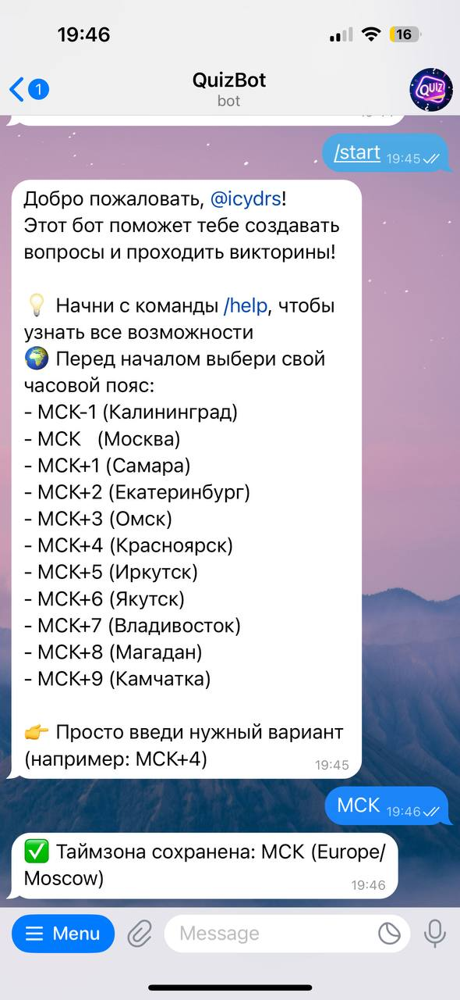
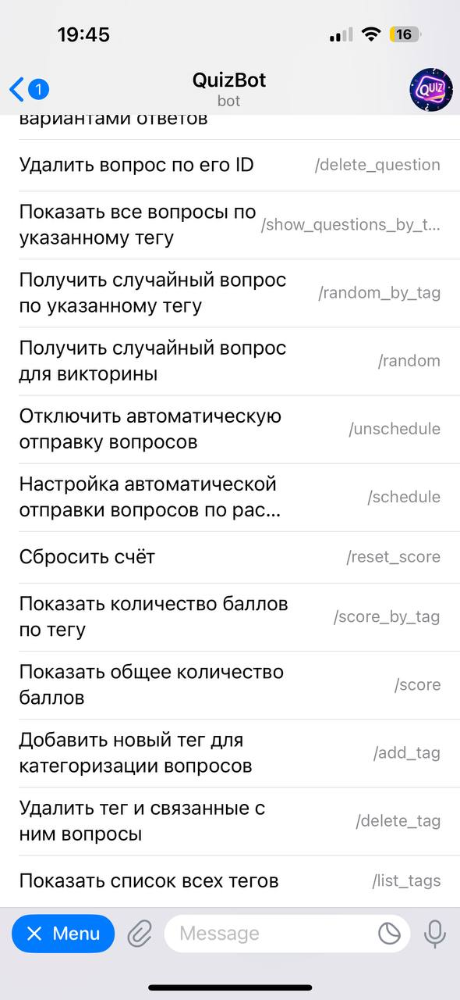

# QuizBot

QuizBot — это серверное Java-приложение, реализующее Telegram-бота для викторин на основе фреймворка Spring. Бот хранит вопросы с ответами и тегами, автоматически отправляет вопросы по расписанию, а также по запросу пользователя — случайные или по определённой теме. Реализована система учёта статистики: отображение общего счёта и результатов по тегам, с возможностью сброса.

Ссылка на Docker Hub репозиторий c Docker-образом:  
[](https://hub.docker.com/repository/docker/alexeyshihalev/quizbot)

Ссылка на Telegram-бота:  
[](https://t.me/tlgrm_quiz_bot)

## Технологический стек

- **Язык программирования:** Java 23
- **Spring Framework 6.2.10** (без Spring Boot)
- **Spring Data JPA 3.5.3** - слой доступа к данным
- **Hibernate 6.6.1** - объектно-реляционное отображение
- **PostgreSQL** - реляционная СУБД
- **Telegram Bots API 6.9.7.1** - взаимодействие с пользователями
- **Quartz 2.5.0** - планировщик задач для автоматической доставки вопросов
- **Jetty 11.0.20** - веб-сервер для REST API
- **Spring REST Docs + Asciidoctor** — генерация документации к REST API
- **Docker + Docker Compose** - контейнеризация и оркестрация сервисов
- **Gradle** - система сборки и управления зависимостями

## Архитектура

   Архитектура проекта построена по принципам чистой архитектуры. Физическая организация кода реализована через пакеты, каждый из которых отвечает за свою зону ответственности:
   
   #### Основные пакеты:
   
   - **ru.spbstu.telegram** - запуск бота, приём и обработка входящих обновлений, обработчики команд и управление состояниями
   - **ru.spbstu.model** - сущности данных: вопросы, варианты ответов, теги, пользователи, расписания
   - **ru.spbstu.repository** - слой доступа к данным с использованием Spring Data JPA
   - **ru.spbstu.service** - бизнес-логика приложения, включая управление вопросами, тегами и пользователями 
   - **ru.spbstu.config** - конфигурация Spring, безопасность, настройки базы данных
   - **ru.spbstu.api** - REST API контролллеры для административных функций
   - **ru.spbstu.admin** - административные вспомогательные компоненты
   - **ru.spbstu.dto** - объекты передачи данных для API

#### Диаграмма приложения:

мб добавить диаграмму

## Основной функционал

#### Управление викторинами
- Создание, редактирование и удаление вопросов
- Система тегов для организации вопросов по категориям (тегам)
- Планировщик автоматической доставки случайных вопросов

#### Управление пользователями
- Регистрация пользователей с настройкой часовых поясов
- Ролевая система доступа (пользователь/администратор)
- Отслеживание статистики и результатов по тегам

#### Команды бота
- `/start` - инициализация бота и настройка часового пояса
- `/help` - отображение доступных команд
- Команды управления вопросами (добавление, редактирование, удаление)
- Команды управления тегами
- Команды участия в викторинах
- Просмотр общего счёта и по определенному тегу

## Установка и запуск

### Вариант 1. Запуск через Docker

   1. **Скачайте образ из Docker Hub:**
   ```bash
   docker pull alexeyshihalev/quizbot:latest
   ```
   
   2. **Создайте и настройте файл .env:**
      - Скопируйте пример:
      ```bash
      cp .env.example .env
      ```
      
      - Затем откройте .env и заполните значения:
      ```bash
      # Telegram
      TELEGRAM_BOT_TOKEN=your_telegram_bot_token
      TELEGRAM_BOT_USERNAME=@your_bot_username
      
      # Postgres
      POSTGRES_USER=postgres
      POSTGRES_PASSWORD=your_password
      POSTGRES_DB=quizbot
      POSTGRES_URL=jdbc:postgresql://postgres:5432/quizbot
      
      # JPA / Hibernate
      JPA_DDL_AUTO=update
      
      # Админ-пользователь по умолчанию
      ADMIN_DEFAULT_LOGIN=admin
      ADMIN_DEFAULT_PASSWORD=admin_password
      ADMIN_DEFAULT_TELEGRAM_ID=your_telegram_user_id
      ```
   
   2. **Настройка docker-compose.yml:**
   
      - Скачайте оригинальный файл: `docker-compose.yml`
   
      - Измените секцию app:
   
       ```yaml
       app:
       image: alexeyshihalev/quizbot:latest
       # Удалите или закомментируйте секцию build
      ```
   3. Запустите приложение:
       ```bash
       docker-compose up -d
       ```
   4. Проверка работы:
       ```bash
       docker-compose logs -f app
       ```
   5. Остановка приложения:
       ```bash
       docker-compose down
       ```

### Вариант 2. Запуск из исходников
   1. **Клонирование репозитория**
   ```bash
   git clone <repository-url>
   cd QuizBot
   ```
   
   2. **Настройка базы данных**
   Создайте PostgreSQL базу данных и обновите настройки подключения в `src/main/resources/application.properties`:
   
   ```properties
   spring.datasource.url=jdbc:postgresql://localhost:5432/quizbot
   spring.datasource.username=your_username
   spring.datasource.password=your_password
   ```
   
   3. **Настройка всех остальных переменных `src/main/resources/application.properties`:**
   
   ```properties
   telegram.bot.token=YOUR_TELEGRAM_BOT_TOKEN
   telegram.bot.username=YOUR_TELEGRAM_BOT_USERNAME
   
   admin.default.login=ADMIN_DEFAULT_LOGIN
   admin.default.password=ADMIN_DEFAULT_PASSWORD
   admin.default.telegram-id=ADMIN_DEFAULT_TELEGRAM_ID
   
   ```
      
   4. **Сборка и запуск**
   
   ```bash
   # Сборка проекта
   ./gradlew build
   
   # Запуск приложения
   ./gradlew run
   
   # Или сборка и запуск JAR
   ./gradlew jar
   java -jar build/libs/quiz-bot-1.0-SNAPSHOT.jar
   ```

## Логирование
Конфигурация Logback предоставляется в `src/main/resources/logback.xml` для комплексного логирования.

## Тестирование

Проект включает модульное тестирование и генерацию документации API:

- Модульные тесты
Используется JUnit 5 и Mockito для проверки сервисов и бизнес-логики в изоляции.
Репозитории и внешние зависимости подменяются моками (@Mock), а сервисы тестируются через @InjectMocks.

- Spring REST Docs
Тесты контроллеров используют Spring REST Docs для генерации сниппетов (snippets) с примерами HTTP-запросов, заголовков и ответов.
Сниппеты затем собираются в полноценную документацию с помощью AsciiDoctor, которая всегда синхронизирована с фактическим поведением API.
Документация доступна в build/docs/asciidoc/index.html.

Запуск тестов:
```bash
./gradlew test
```

Сборка документации
```bash
./gradlew asciidoctor
```

## Использование

### 1. HTTP эндпоинты

| Метод | Путь | Описание | Права доступа |
|-------|------|----------|---------------|
| GET | `/healthcheck` | Возвращает список студентов и состояние приложения | Любой пользователь |
| GET | `/admin/users` | Возвращает список всех зарегистрированных пользователей. | Только ADMIN |
| POST | `/admin/users/{userId}/promote` | Повысить роль пользователя с указанным userId. Присваивает роль ADMIN, генерирует новый логин и пароль. | Только ADMIN |
| POST | `/admin/users/{userId}/demote` | Понизить роль пользователя с указанным userId. Удаляет роль ADMIN. | Только ADMIN |
| POST | `/admin/users/{userId}/reset-score` | Сбросить счет пользователя с указанным userId. | Только ADMIN |
| POST | `/admin/questions/upload-csv` | Загрузка вопросов из CSV файла. Поддерживает массовое добавление вопросов. | Только ADMIN |

### 2. Telegram команды

#### Управление вопросами
| Команда | Описание |
|---------|----------|
| `/add_question` | Создание нового вопроса. Пользователь последовательно вводит необходимые параметры (текст вопроса, варианты ответов, правильный ответ, теги). |
| `/show_questions_by_tag <тег>` | Отображение всех вопросов с указанным тегом. |
| `/delete_question <ID>` | Удаление вопроса по указанному идентификатору. |

#### Управление тегами
| Команда | Описание |
|---------|----------|
| `/add_tag` | Добавление нового тега для категоризации вопросов. |
| `/list_tags` | Отображение списка всех доступных тегов. |
| `/delete_tag <тег>` | Удаление тега и всех связанных с ним вопросов. |

#### Викторины
| Команда | Описание |
|---------|----------|
| `/random` | Получение случайного вопроса для ответа. |
| `/random_by_tag <тег>` | Получение случайного вопроса по указанному тегу. |

#### Статистика и результаты
| Команда | Описание |
|---------|----------|
| `/score` | Отображение общего количества баллов пользователя. |
| `/score_by_tag <тег>` | Показать количество баллов по конкретному тегу. |
| `/reset_score` | Сбросить свой счет (все вопросы откроются заново для пользователя). |

#### Расписание
| Команда | Описание |
|---------|----------|
| `/schedule` | Настройка автоматической отправки вопросов по расписанию. |
| `/unschedule` | Отключение автоматической отправки вопросов. |

#### Служебные и информационные команды
| Команда | Описание |
|---------|----------|
| `/start` | Регистрация нового пользователя и присвоение часового пояса. |
| `/healthcheck` | Отображение текущего состояния бота и информации об авторах. |
| `/help` | Вывод справочного сообщения со списком всех доступных команд. |

### 3. Примеры использования

<div style="display: flex; gap: 10px; flex-wrap: wrap;">






</div>

## Лицензия

Проект распространяется под лицензией MIT. Подробнее см. файл [LICENSE](LICENSE).

## Авторы
- [Шихалев Алексей](https://github.com/alexeyshihalev)  
- [Емешкин Максим](https://github.com/username_emeshkin)
